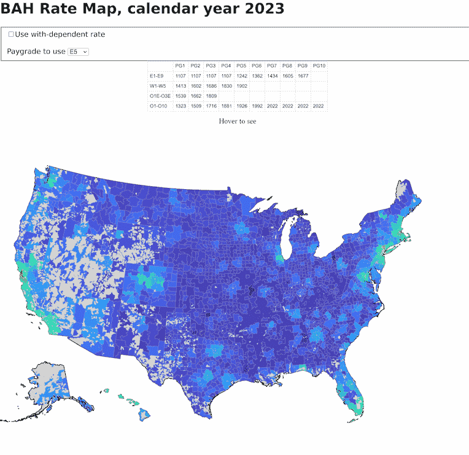

# BAH Rate Map

This is a set of scripts to build a simple web page showing U.S. DoD basic
allowance for housing (BAH) rates on a map, as a graphical supplement to the
[official BAH rate
calculator](https://www.travel.dod.mil/Allowances/Basic-Allowance-for-Housing/BAH-Rate-Lookup/).

It is very basic!  Mostly just here to automate the rules I struggled to put
together over a weekend but I'm hopeful it can be filled in to make a useful
web page later.

# Product

The final product is an index.html driving a [D3.js](https://d3js.org/)-based
geographic map visualization of supporting JSON and CSV data (either sourced
externally or generated by scripts in this repository).

The DoD BAH rates are based upon ZIP codes of each official DoD duty station.
ZIP codes are grouped into "Major Housing Areas" (MHAs), and these MHAs are
what BAH rates are defined for.

ZIP codes do not have a native geographic representation (they are assigned to
postal routes from a post office, not areas of a map), however the U.S. Census
Bureau defines related geographic representations called [Zip Code Tabulation
Areas (ZCTAs)](https://www.census.gov/programs-surveys/geography/guidance/geo-areas/zctas.html).

These ZCTAs *can* be shown on a map, and that is what is done by the scripts in
this repository, which work to pull ZIP code assignments for each MHA into a
merged set of ZCTAs for each MHA.

# Data Issues

Creating a map this way has some issues in that not every ZIP code used in an
MHA has a corresponding ZCTA, and nor is every ZCTA guaranteed to be completely
accurate (there may be addresses with a ZIP code that are not physically within
its corresponding ZCTA).  However overall there seems to be a close alignment,
certainly enough to be worth putting a visualization around.

# Setup

These instructions are written for Linux but should be similar on BSD and
macOS, and may work with only fine adjustment on Windows (but for Windows users
I recommend WSL anyways).

The index.html is provided with this repository, and the D3.js is downloaded by
the browser on each page view.

However the data used on the page (`us_dod_mha.topo.json`) needs to be built
before hand.

To do this, first make sure you [have the dependencies you
need](#dependencies), then:

* Download [the 2020 Census ZCTA data](https://www2.census.gov/geo/tiger/GENZ2020/shp/cb_2020_us_zcta520_500k.zip)
  and save it into the directory you downloaded this repository to. These are
  the Census ZCTA shapes we will process.
    * However if you have the "wget" tool you can let the "Make" command
      download this for you when it runs later, if you will have Internet
      access where "Make" runs.
* Go to https://www.travel.dod.mil/Allowances/Basic-Allowance-for-Housing/BAH-Rate-Lookup/
  and in the "All BAH Rates" section download the "ASCII" file type version of the
  BAH rates for the year you care about (2023 in my case). Save it to the same location
  you saved the Census ZCTA data to. This is the DoD MHA BAH rate data which the
  web page will use almost as-is.
* Open a command line terminal pointing to the directory you have downloaded
  this repository to.
* From within the command line, run `make`.
* Make will do several things. Assuming you have all the dependencies, make will
  install some small NPM packages to do topography handling, extract the data
  from the ZIP files you downloaded, and then run the NPM packages to process and simplify
  the data into a form the index.html can use.
    * Make will probably take a lot of time running `ogr2ogr` to start. This is expected, the
      Census data is quite large.
* Assuming Make completes without error, you should be able to run `make serve` and then
  open a browser to http://localhost:8000/ to see the live map!

## Dependencies

You will need several dependencies installed to process the data and run the
local web server to see the results:

* [NodeJS](https://nodejs.org/)
* Make (likely available in your Linux distribution already)
* Wget (likely available in your Linux distribution already; optional to download Census data)
* Unzip (likely available in your Linux distribution already, provided by InfoZIP)
* [Perl](https://www.perl.org/) (to copy over MHA data into the geographic data... will be rewritten later to use Python or NodeJS).
* [Python](https://www.python.org/) (if you want to run `make serve`). It's probably already on your Linux install.
* [GDAL](https://gdal.org/index.html#), which provides the ogr2ogr tool needed to convert the Census data to a usable format.
* Other scripts are needed but will be downloaded by Make using NodeJS, and installed only in this repository directory.

# Author

This was put together by CDR Mike Pyne, USN, in an unofficial capacity.
